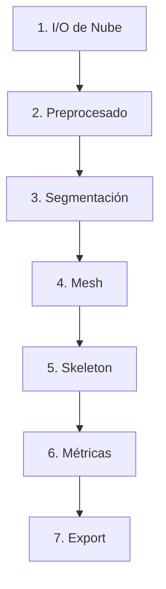

# LiDAR PlotSafe Pipeline Documentation

* [1. Introducción](#1-introducción)
* [2. Alcance](#2-alcance)

  * [2.1. Métricas a extraer](#21-métricas-a-extraer)
  * [2.2. Límites del MVP](#22-límites-del-mvp)
  * [2.3. Protocolo de validación y muestreo in situ](#23-protocolo-de-validación-y-muestreo-in-situ)
* [3. Requisitos del Sistema](#3-requisitos-del-sistema)

  * [3.1. Sistema Operativo](#31-sistema-operativo)
  * [3.2. Python](#32-python)
  * [3.3. Hardware Recomendado](#33-hardware-recomendado)
  * [3.4. Dependencias Principales](#34-dependencias-principales)
  * [3.5. Herramientas Auxiliares](#35-herramientas-auxiliares)
* [4. Arquitectura y Flujo de Datos](#4-arquitectura-y-flujo-de-datos)
* [5. Instalación y Configuración](#5-instalación-y-configuración)

  * [5.1. Entorno Virtual](#51-entorno-virtual)
  * [5.2. Dependencias](#52-dependencias)
* [6. Uso Básico](#6-uso-básico)

  * [6.1. Ejecución del Pipeline](#61-ejecución-del-pipeline)
  * [6.2. Parámetros y Opciones](#62-parámetros-y-opciones)
* [7. Estructura de Código](#7-estructura-de-código)
* [8. Desarrollo y Contribución](#8-desarrollo-y-contribución)

  * [8.1. Estilo de Código](#81-estilo-de-código)
  * [8.2. Pruebas Unitarias](#82-pruebas-unitarias)
  * [8.3. CI/CD](#83-cicd)
* [9. Roadmap y Futuras Extensiones](#9-roadmap-y-futuras-extensiones)
* [10. Referencias y Recursos](#10-referencias-y-recursos)
* [11. Licencia](#11-licencia)

---

## 1. Introducción

Tradicionalmente, los inventarios de parcelas forestales requieren que un equipo humano inspeccione cada árbol y extraiga manual y visualmente métricas como el diámetro a la altura del pecho (DBH), la altura total y la clasificación de defectos, un proceso laborioso y propenso a errores humanos.

La adopción de LiDAR terrestre y aéreo ha demostrado ofrecer datos de inventario confiables y repetibles, con precisión milimétrica, adecuados para evaluación de biomasa, estimaciones de carbono y monitoreo de crecimiento.

Sensores LiDAR móviles como Hovermap capturan nubes de puntos que reproducen el entorno real en 3D, creando un gemelo digital del bosque que posibilita la automatización de la extracción de métricas y características de cada árbol y del rodal completo, reduciendo tiempo de campo, costes operativos y sesgos de operador.

Interpine domina actualmente el mercado de procesamiento PlotSafe en Nueva Zelanda y Australia con su suite propietaria; este proyecto propone una alternativa de código abierto 100 % Python/pip que automatiza la extracción de todas las métricas PlotSafe (DBH, altura, sweep, ramas y características de tronco) sin intervención directa, democratizando el acceso y fomentando la competencia.

## 2. Alcance

### 2.1. Métricas a extraer

Todas las métricas definidas en el PDF *HQP Quickcard LiDAR pt 1*:

* **DBH** (diámetro a 1,3 m) y **altura total**
* **Sweep (SW)**: SED ratio en ventanas de 6 m, 4 m y 0.3–1 m (códigos 8, L, S, 3, 1, X, W, K)
* **Branches (BR)**: diámetro máximo de nudos/prune (0 cm, 4 cm, 7 cm, 10 cm, 15 cm, > 15 cm)
* **Features de tronco (F)**:

  * Butt flare (B10+)
  * Nodal swelling (N10+)
  * Spike knots y spike call (S7+, S10+, S16+, S25+)
  * Daño/escarring (D)
  * Rot/insect damage (R)
  * Fluting (F5+, F10+)
  * Crutch/fork (C)
  * Ovality (O1.2)
  * Live windthrown

### 2.2. Límites del MVP

* **Radio del plot**: hasta \~15 m desde el centro
* **Número de árboles**: hasta \~80 individuos por plot
* **Formatos de entrada**: nubes LAS/LAZ sin clasificación previa

### 2.3. Protocolo de validación y muestreo in situ

* **Árboles muestreados**: máximo 5 por plot, cubriendo extremos y rangos intermedios de DBH y altura
* **Métricas manuales**:

  1. **DBH**: cinta diamétrica a 1,3 m
  2. **Altura total**: Vertex/Transponder o clinómetro + cinta
  3. **Sweep**: clasificación visual según códigos PlotSafe
* **Árbol central (#1)**: descripción opcional detallada de ramas y características de tronco
* **Objetivos de validación**:

  * DBH → RMSE < 2 cm
  * Altura → RMSE < 0.15 m
  * Sweep → Accuracy > 85 %

## 3. Requisitos del Sistema

### 3.1. Sistema Operativo

* Windows 11 (64 bit) o Linux (Ubuntu 20.04+)

### 3.2. Python

* Python 3.10 o superior
* Entorno virtual con `venv` y `pip`

### 3.3. Hardware Recomendado

* **RAM**: 16 GB mínimo, 32 GB recomendado
* **CPU**: Intel i7 o AMD Ryzen 7 (2020+)
* **GPU**: NVIDIA GeForce GTX 1060+ para procesamiento acelerado (opcional pero recomendado)
* **Almacenamiento**: 500 GB SSD mínimo para nubes de puntos e intermedios

### 3.4. Dependencias Principales

* **Procesamiento de nubes de puntos**:
  * laspy==2.5.3
  * lazrs>=0.4.0 (backend obligatorio para descompresión de archivos LAZ)
  * open3d==0.17.0
  * pyntcloud==0.3.1

* **Ciencia de datos y matemáticas**:
  * numpy==2.3.1
  * scipy==1.10.1
  * pandas==2.0.3

* **Configuración**:
  * pyyaml==6.0.1

* **Interfaz gráfica**:
  * tkinter (incluido en Python estándar)

### 3.5. Herramientas Auxiliares

* **CloudCompare** (para extracción de coordenadas semilla)
* **Visual Studio Build Tools** (solo si se integra `python-pcl`, opcional)

## 4. Arquitectura y Flujo de Datos

El pipeline se organiza en módulos que pueden ejecutarse individualmente o mediante un script maestro (`run.py`).



1. **I/O de Nube** (`io.py`): carga LAS/LAZ con `laspy` y recorte espacial.
2. **Preprocesado** (`preprocess.py`): filtrado de terreno (Open3D RANSAC o método basado en altura) y eliminación de outliers.
3. **Segmentación** (`segmentation.py`): DBSCAN/region growing para aislar troncos.
4. **Mesh** (`mesh.py`): Poisson Reconstruction y suavizado.
5. **Skeleton** (`skeleton.py`): eje central por thinning voxel y PCA.
6. **Métricas** (`metrics.py`): DBH, altura, sweep, branches, features.
7. **Export** (`export.py`): CSV/XLSX con `pandas`, JSON opcional.

## 5. Instalación y Configuración

### 5.1. Entorno Virtual

Crear y activar:

```bash
# Windows
python -m venv .venv
.venv\Scripts\activate.bat

# Linux
python -m venv .venv
source .venv/bin/activate
```

### 5.2. Dependencias

```bash
# Actualizar pip y setuptools
pip install --upgrade pip setuptools

# Instalar dependencias
pip install -r requirements.txt

# Importante: asegurarse que lazrs está correctamente instalado
pip install lazrs
```

**Nota importante**: Para trabajar con archivos LAZ (comprimidos), es fundamental tener instalado el paquete `lazrs` como backend para `laspy`. Sin este backend, los archivos LAZ no pueden descomprimirse. Además, se han detectado problemas con archivos que no siguen el estándar LAS/LAZ (como archivos con firma incorrecta "CCB2"), lo que puede requerir conversión previa con herramientas externas como LAStools o CloudCompare.

## 6. Uso Básico

### 6.1. Ejecución del Pipeline

El pipeline puede ejecutarse a través de la interfaz gráfica:

```bash
python -m src.gui.launcher
```

**Características actuales de la interfaz**:

* Carga de archivos LAS/LAZ y visualización de información básica
* Barra de progreso con porcentaje visible al lado derecho
* Panel "Point Cloud Summary" con información detallada (puntos, dimensiones, densidad)
* Manejo robusto de errores y excepciones
* Mensajes claros que incluyen el nombre del archivo procesado
* Visualización intuitiva de rangos de coordenadas y densidad de puntos

### 6.2. Parámetros y Opciones

Listado completo de flags y configuración en `config.yaml` o CLI:

| Parámetro   | Descripción                                                  | Valor por defecto |
| ----------- | ------------------------------------------------------------ | ----------------- |
| `--input`   | Ruta al archivo LAS/LAZ                                      | —                 |
| `--output`  | Archivo de salida (CSV o XLSX)                               | `results.csv`     |
| `--mesh`    | Generar mesh (true/false)                                    | `false`           |
| `--radius`  | Radio de recorte del plot (m)                                | `15.0`            |
| `--seed`    | Coordenada XYZ para árbol central (semilla para aislamiento) | —                 |
| `--verbose` | Habilita logs detallados                                     | `false`           |
| `--threads` | Número de hilos para procesamiento paralelo                  | `4`               |
| `--config`  | Ruta a un archivo YAML con parámetros avanzados              | —                 |

O también puedes usar un archivo `config.yaml` con:

```yaml
input: examples/plot1.laz
output: examples/plot1_metrics.csv
mesh: true
radius: 15.0
seed: [123.456, 789.012, 25.300]
verbose: true
threads: 8
```

Y ejecutar sin flags:

```bash
python run.py --config config.yaml
```

### 6.3. Outputs Generados

Además del archivo de métricas (`results.csv` o `.xlsx`), el pipeline entrega opcionalmente (*flags* o configuración en YAML) los siguientes artefactos para inspección y validación en visores 3D como CloudCompare:

* **Nube clasificada** (`classified_plot.laz`): cada punto con etiqueta de clase (suelo, tronco, vegetación).
* **Clusters individuales** (`tree_01.laz`, `tree_02.laz`, …): puntos de cada árbol aislado.
* **Esqueletos 3D** (`tree_01_skeleton.ply`, …): líneas que representan el eje central de cada tronco.
* **Secciones ajustadas** (`tree_01_section1.ply`, …): conjunto de puntos de cada sección y el círculo de ajuste para validar DBH.
* **Visualización de alturas** (`tree_01_heights.ply`): nube coloreada por altura normalizada para cada árbol.
* **Mesh de troncos** (*opcional*): malla Poisson de cada tronco si se usa flag `--mesh`.

  * **Color mapping of stem features**: apply color symbology on the mesh to highlight trunk defects and characteristics (e.g., spike knots, forks, damage/scarring, fluting depth, excessive ovality, nodal swelling, butt flare).

(Activa cada salida con los flags correspondientes o configurándolo en `config.yaml`.)

### 6.4. Mini‑GUI opcional con Tkinter

Para agilizar la interacción del MVP sin depender totalmente de la terminal, se incluye un pequeño **launcher** basado en **Tkinter**.
Su objetivo es únicamente:

1. **Seleccionar archivos de entrada**.

   * Botón “Select LAS/LAZ” ⇒ abre un `filedialog.askopenfilename()` para elegir la nube.
   * Botón “Select params CSV/XLSX” ⇒ abre un `filedialog.askopenfilename()` para escoger el archivo de parámetros.
2. **Ejecutar el pipeline** con esos paths pre‑cargados y parámetros por defecto (radio, verbose, etc.).
3. **Mostrar progreso** simple: una `ttk.Progressbar` (modo `determinate`) avanza según las etapas (load ↦ preprocess ↦ segment ↦ metrics ↦ export).

   * Mensaje de estado en una etiqueta (`ttk.Label`) indica la fase actual y tiempo transcurrido.
4. **Cerrar** cuando finaliza y abrir el directorio de resultados.

> **Nota técnica**: este widget vive en `src/gui/launcher.py` y se invoca con `python launcher.py`. No remplaza la CLI; es un atajo opcional para usuarios no técnicos.

---

## 7. Estructura de Código

El código se organiza en módulos especializados:

```
LiDAR_PlotSafe/
  ├── src/
  │   ├── gui/
  │   │   └── launcher.py   # Interfaz gráfica principal (Tkinter)
  │   ├── io.py             # Carga y lectura de archivos LAS/LAZ
  │   ├── preprocess.py     # (Pendiente) Preprocesamiento de nubes
  │   ├── segmentation.py   # (Pendiente) Segmentación de árboles
  │   ├── metrics.py        # (Pendiente) Extracción de métricas
  │   └── export.py         # (Pendiente) Exportación de resultados
  ├── tests/
  │   ├── test_io.py        # Pruebas unitarias para io.py
  │   └── ...               # Otras pruebas unitarias
  ├── config.yaml           # Configuración general
  ├── requirements.txt      # Dependencias del proyecto
  └── README.md             # Documentación general
```

**Módulos implementados**:

* **io.py**: Módulo para carga y lectura de archivos LAS/LAZ
  * `load_point_cloud()`: Carga completa de un archivo con estadísticas
  * `get_file_info()`: Obtiene metadatos sin cargar todos los puntos
  * `is_valid_point_cloud_file()`: Valida que un archivo tenga formato correcto
  * `get_supported_extensions()`: Lista de extensiones soportadas

* **gui/launcher.py**: Interfaz gráfica principal
  * Carga de archivos mediante diálogo de selección
  * Visualización de progreso y estadísticas
  * Manejo de errores y excepciones
  * Navegación entre vistas del procesamiento

## 8. Desarrollo y Contribución

Esta sección detalla las prácticas de colaboración, estilo de código, pruebas y configuración de integración continua para asegurar calidad y mantenibilidad.

### 8.1. Estilo de Código

* Sigue **PEP 8** para formato de código, nombres de variables y espaciado.
* Utiliza **docstrings** en cada función, clase y módulo siguiendo el estilo Google o NumPy.
* Ejecuta **linters** como `flake8` o `pylint` antes de confirmar cambios. Ejemplo:

  ```bash
  flake8 src/pipeline/
  ```
* Escribe comentarios concisos en inglés que expliquen *por qué* se realiza una operación, no sólo *qué* hace el código.

### 8.2. Pruebas Unitarias

* Emplea **pytest** para cubrir cada módulo crítico (`io.py`, `preprocess.py`, `segmentation.py`, `metrics.py`).
* Los tests se ubican en la carpeta `tests/`, con archivos nombrados `test_<módulo>.py`.
* Ejemplo de test para `io.py`:

  ```python
  import pytest
  from pipeline.io import load_las

  def test_load_las_valid_path(tmp_path):
      las_path = tmp_path / "test.las"
      # Usar laspy para crear un LAS mínimo para prueba
      df = load_las(str(las_path))
      assert "X" in df.columns and "Y" in df.columns
  ```
* Ejecuta todos los tests con:

  ```bash
  pytest --maxfail=1 --disable-warnings -q
  ```

### 8.3. CI/CD

* Configura **GitHub Actions** en `.github/workflows/ci.yml` para:

  1. Activar el entorno virtual y listar dependencias.
  2. Instalar `requirements.txt`.
  3. Ejecutar `flake8`.
  4. Ejecutar `pytest`.
  5. (Opcional) Generar documentación con Sphinx.

* Ejemplo de `ci.yml`:

  ```yaml
  name: CI  
  on: [push, pull_request]  
  jobs:  
    build:  
      runs-on: ubuntu-latest  
      steps:  
        - uses: actions/checkout@v2  
        - name: Set up Python  
          uses: actions/setup-python@v2  
          with:  
            python-version: '3.10'  
        - name: Install dependencies  
          run: |  
            python -m venv .venv  
            source .venv/bin/activate  
            pip install -r requirements.txt  
            pip install flake8 pytest sphinx  
        - name: Lint with flake8  
          run: flake8 src/pipeline/  
        - name: Test with pytest  
          run: pytest --maxfail=1 --disable-warnings -q  
        - name: Build docs  
          run: |  
            cd docs  
            make html  
  ```

* Para reproducibilidad, considera un **Dockerfile** que instale Python 3.10, copie el repositorio, instale dependencias y ejecute tests.

## 9. Roadmap y Futuras Extensiones

Esta sección describe posibles mejoras y funcionalidades a incorporar tras el MVP.

1. **Interfaz Gráfica de Usuario (GUI)**

   * Implementar GUI con **PySide** para cargar nubes, seleccionar árbol central, ejecutar pipeline y visualizar resultados.
2. **Integración con Aura**

   * Automatizar la carga de nubes en Emesent Aura y descarga de GCP georreferenciados.
3. **Módulo de Validación Avanzada**

   * Incorporar comparaciones automáticas con CSV externos o protocolos de muestreo in situ mejorados.
4. **API Web REST**

   * Desplegar un backend ligero (FastAPI/Django) para procesar nubes remotas y servir resultados a clientes.
5. **Optimización de Rendimiento**

   * Reintroducir **PDAL** para mejorar velocidad en preprocesado y lectura masiva.
6. **Soporte para Nuevos Sensores**

   * Extender compatibilidad a nubes de fotogrametría (E57, PLY) y otros TLS.
7. **Modelos de Deep Learning**

   * Entrenar redes para clasificar ramas y defectos directamente en nubes 3D con **PyTorch** o **TensorFlow**.
8. **Visualización Avanzada**

   * Integrar **Open3D visualizer** y herramientas de dashboard en GUI para inspección rápida.

## 10. Referencias y Recursos

* **laspy**: [https://laspy.readthedocs.io/](https://laspy.readthedocs.io/)
* **Open3D**: [https://www.open3d.org/docs/](https://www.open3d.org/docs/)
* **pyntcloud**: [https://github.com/jeanjavier/pyntcloud](https://github.com/jeanjavier/pyntcloud)
* **csf-python**: [https://github.com/jinyuff/CSF](https://github.com/jinyuff/CSF)
* **NumPy**: [https://numpy.org/doc/](https://numpy.org/doc/)
* **SciPy**: [https://docs.scipy.org/doc/](https://docs.scipy.org/doc/)
* **scikit-learn**: [https://scikit-learn.org/stable/](https://scikit-learn.org/stable/)
* **pandas**: [https://pandas.pydata.org/docs/](https://pandas.pydata.org/docs/)
* **matplotlib**: [https://matplotlib.org/stable/contents.html](https://matplotlib.org/stable/contents.html)
* **PyTorch**: [https://pytorch.org/docs/](https://pytorch.org/docs/)
* **TensorFlow**: [https://www.tensorflow.org/api\_docs](https://www.tensorflow.org/api_docs)
* **CloudCompare**: [https://www.cloudcompare.org/](https://www.cloudcompare.org/)
* **PDAL**: [https://pdal.io/](https://pdal.io/)
* **TreeQSM**: [https://github.com/jwomesager/TreeQSM](https://github.com/jwomesager/TreeQSM)
* **Mermaid**: [https://mermaid-js.github.io/mermaid/#/](https://mermaid-js.github.io/mermaid/#/)

## 11. Licencia

Este proyecto es **completamente propietario** y todos los derechos están reservados. Ninguna parte de este código, diseño o interfaz gráfica puede usarse, modificarse, distribuirse o sublicenciarse sin el permiso expreso y por escrito del propietario.

```text
 2025 LiDAR PlotSafe Project. Todos los derechos reservados.
```
